# Support my work

Donation page for my free tools: Kanvaz, Obscura, Glint, MINK and 3D Ref Skills.

- **Anywhere in the world:** [buymeacoffee.com/p4inz](https://buymeacoffee.com/p4inz)
- **In India:** UPI, on the [donation page](https://p4inz-code.github.io/donate/)

Nothing is gated behind a donation. It just buys more evenings for the next release.

More at [atharvapatil.tech/support](https://atharvapatil.tech/support/).
